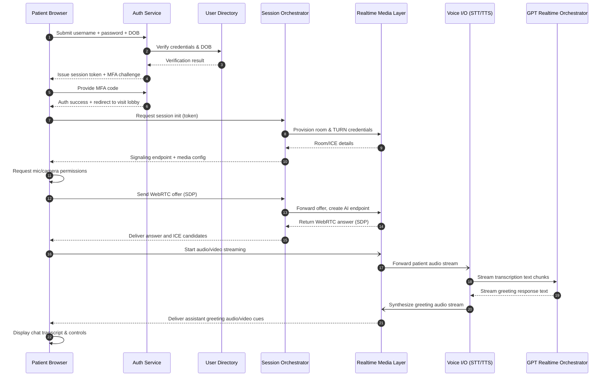
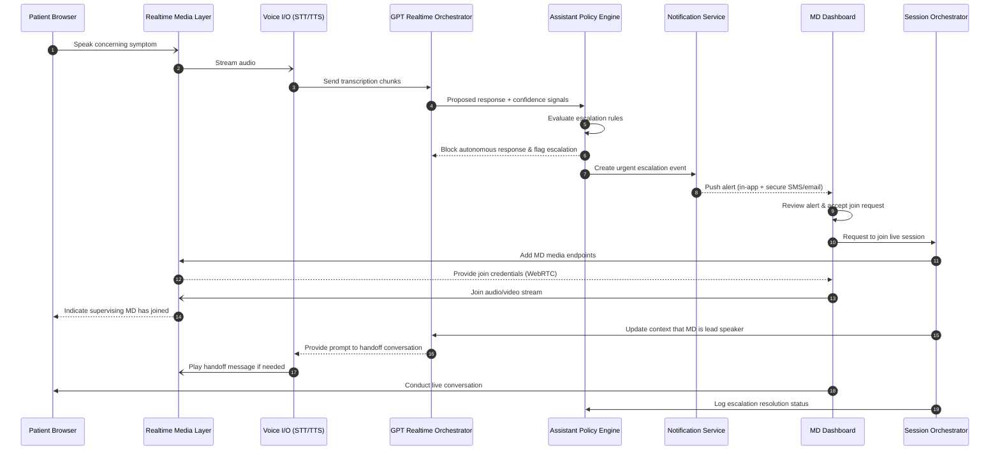
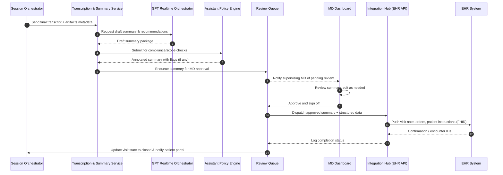

# AI Ophthalmology Assistant Sequence Diagrams

## 1. Patient Login and Voice Greeting

```mermaid
sequenceDiagram
    autonumber
    participant Patient as Patient Browser
    participant Auth as Auth Service
    participant Directory as User Directory
    participant Session as Session Orchestrator
    participant Media as Realtime Media Layer
    participant Voice as Voice I/O (STT/TTS)
    participant GPT as GPT Realtime Orchestrator

    Patient->>Auth: Submit username + password + DOB
    Auth->>Directory: Verify credentials & DOB
    Directory-->>Auth: Verification result
    Auth-->>Patient: Issue session token + MFA challenge
    Patient->>Auth: Provide MFA code
    Auth-->>Patient: Auth success + redirect to visit lobby
    Patient->>Session: Request session init (token)
    Session->>Media: Provision room & TURN credentials
    Media-->>Session: Room/ICE details
    Session-->>Patient: Signaling endpoint + media config
    Patient->>Patient: Request mic/camera permissions
    Patient->>Session: Send WebRTC offer (SDP)
    Session->>Media: Forward offer, create AI endpoint
    Media-->>Session: Return WebRTC answer (SDP)
    Session-->>Patient: Deliver answer and ICE candidates
    Patient-)Media: Start audio/video streaming
    Media-)Voice: Forward patient audio stream
    Voice->>GPT: Stream transcription text chunks
    GPT-->>Voice: Stream greeting response text
    Voice-)Media: Synthesize greeting audio stream
    Media-->>Patient: Deliver assistant greeting audio/video cues
    Patient->>Patient: Display chat transcript & controls
```

## 2. Symptom Escalation to Supervising MD

```mermaid
sequenceDiagram
    autonumber
    participant Patient as Patient Browser
    participant Media as Realtime Media Layer
    participant Voice as Voice I/O (STT/TTS)
    participant GPT as GPT Realtime Orchestrator
    participant Policy as Assistant Policy Engine
    participant Notify as Notification Service
    participant MD as MD Dashboard
    participant Session as Session Orchestrator

    Patient-)Media: Speak concerning symptom
    Media-)Voice: Stream audio
    Voice->>GPT: Send transcription chunks
    GPT->>Policy: Proposed response + confidence signals
    Policy->>Policy: Evaluate escalation rules
    Policy-->>GPT: Block autonomous response & flag escalation
    Policy->>Notify: Create urgent escalation event
    Notify-->>MD: Push alert (in-app + secure SMS/email)
    MD->>MD: Review alert & accept join request
    MD->>Session: Request to join live session
    Session->>Media: Add MD media endpoints
    Media-->>MD: Provide join credentials (WebRTC)
    MD-)Media: Join audio/video stream
    Media-->>Patient: Indicate supervising MD has joined
    Session->>GPT: Update context that MD is lead speaker
    GPT-->>Voice: Provide prompt to handoff conversation
    Voice-)Media: Play handoff message if needed
    MD->>Patient: Conduct live conversation
    Session->>Policy: Log escalation resolution status
```

## 3. Visit Summary Approval and EHR Sync

```mermaid
sequenceDiagram
    autonumber
    participant Session as Session Orchestrator
    participant Transcript as Transcription & Summary Service
    participant GPT as GPT Realtime Orchestrator
    participant Policy as Assistant Policy Engine
    participant Queue as Review Queue
    participant MD as MD Dashboard
    participant Integration as Integration Hub (EHR API)
    participant EHR as EHR System

    Session->>Transcript: Send final transcript + artifacts metadata
    Transcript->>GPT: Request draft summary & recommendations
    GPT-->>Transcript: Draft summary package
    Transcript->>Policy: Submit for compliance/scope checks
    Policy-->>Transcript: Annotated summary with flags (if any)
    Transcript->>Queue: Enqueue summary for MD approval
    Queue-->>MD: Notify supervising MD of pending review
    MD->>MD: Review summary, edit as needed
    MD->>Queue: Approve and sign off
    Queue->>Integration: Dispatch approved summary + structured data
    Integration->>EHR: Push visit note, orders, patient instructions (FHIR)
    EHR-->>Integration: Confirmation / encounter IDs
    Integration-->>Queue: Log completion status
    Queue->>Session: Update visit state to closed & notify patient portal
```
